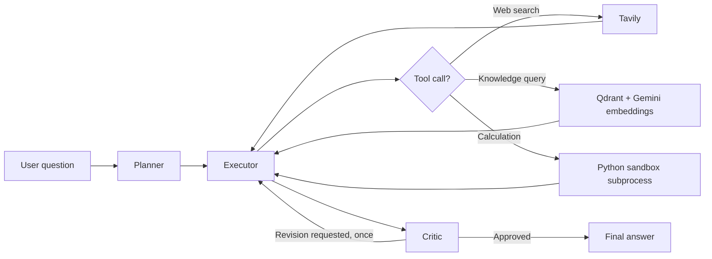

# ResearchPilot Agent

ResearchPilot is a self-correcting research assistant built with **LangGraph**, **Groq**, **Tavily**, **Qdrant**, **Gemini embeddings**, and **Streamlit**.

🌟 **Live demo:** [researchpilot-agent-ask-query.streamlit.app](https://researchpilot-agent-ask-query.streamlit.app/)

The agent accepts a natural-language question, creates a short plan, uses the appropriate tools, drafts an answer, and reviews its own result. It can combine web search, retrieval from a Qdrant knowledge base, and isolated Python calculations.

## What is implemented

- Plan-and-execute agent graph with a planner, executor, tools node, and critic.
- Tavily web search for current or general-purpose research.
- Qdrant vector retrieval for domain-specific documents.
- Gemini embeddings for knowledge-base queries.
- Sandboxed Python execution in a separate subprocess.
- Streamlit UI with expandable planner, tool-call, tool-output, draft, and critic traces.
- CLI entry point for running the agent without Streamlit.
- One critic-driven revision cycle and safeguards against unbounded tool loops.

## Architecture



The executor is configured with `qwen/qwen3.8-27b` through `langchain-groq`. Tool execution is capped at four tool-result rounds, and consecutive tool errors are capped at two. The critic can send the draft back to the executor for one revision.

## Repository layout

| Path | Purpose |
|---|---|
| `app.py` | Streamlit application |
| `src/agent.py` | LangGraph workflow and retry/safeguard logic |
| `src/tools.py` | Tavily, Qdrant, and Python tools |
| `src/sandbox.py` | Sandbox validation, limits, subprocess orchestration, and result parsing |
| `src/_sandbox_worker.py` | Restricted worker process that executes generated Python |
| `src/main.py` | CLI runner with a textual execution trace |
| `tests/test_sandbox.py` | Sandbox and security tests |
| `test_connections.py` | Optional Qdrant and Gemini connectivity checks |
| `test_models.py` | Optional Groq model-list diagnostic |
| `evaluate.py` | Runs the sample evaluation questions and rewrites `EVALUATION.md` |
| `docs/SECURITY.md` | Threat model, controls, limitations, and security audit history |
| `demo_traces/` | Example plan/execute/self-correction trace |

## Requirements

- Python 3.10 or newer
- API keys for Groq, Tavily, and Google Gemini
- A Qdrant Cloud collection named `documents` for knowledge-base retrieval
- Windows, macOS, and Linux are supported; the strongest OS-level resource limits are available on Linux

## Installation

Create and activate a virtual environment, then install the dependencies:

```powershell
python -m venv venv
.\venv\Scripts\activate
python -m pip install -r requirements.txt
```

On macOS/Linux:

```bash
python3 -m venv venv
source venv/bin/activate
python -m pip install -r requirements.txt
```

Copy `.env.example` to `.env` and fill in the values:

```env
GROQ_API_KEY=your_groq_api_key
TAVILY_API_KEY=your_tavily_api_key
GEMINI_API_KEY=your_gemini_api_key
QDRANT_URL=https://your-cluster-url
QDRANT_API_KEY=your_qdrant_api_key
```

Never commit `.env` or real credentials. The application loads these variables with `python-dotenv`.

## Qdrant knowledge base

The retrieval tool expects:

- collection name: `documents`
- vector embeddings compatible with `models/gemini-embedding-001`
- payload field `text` containing the indexed chunk
- optional payload fields `document_id` and `chunk_index` for result labels

This repository currently contains the retrieval client but **does not contain a document-ingestion/indexing pipeline**. Populate the collection separately before testing knowledge-base questions.

## Run the application

Start the Streamlit UI:

```bash
streamlit run app.py
```

On Windows, `start.bat` creates no environment by itself; it expects an existing `venv` directory, installs `requirements.txt`, and starts Streamlit:

```bat
start.bat
```

The UI displays the plan, tool calls, tool outputs, draft answer, critic result, and final answer. A query can take a minute on free-tier LLM limits.

## Run from the CLI

With the virtual environment active:

```bash
python -m src.main "What is the capital of France?"
```

If no question is provided, the CLI prompts interactively. The CLI requires `GROQ_API_KEY`, `TAVILY_API_KEY`, and `GEMINI_API_KEY` to be present, even when a particular question does not use every integration.

## Tests and evaluation

The sandbox tests do not require API keys or external services:

```bash
python -m unittest tests.test_sandbox -v
```

If `pytest` is installed, the equivalent command is:

```bash
python -m pytest tests/test_sandbox.py -v
```

Run the optional live evaluation only after configuring all services:

```bash
python evaluate.py
```

The evaluation script makes multiple LLM/tool calls, sleeps between questions to reduce rate-limit pressure, and rewrites `EVALUATION.md` with its results. The current checked-in evaluation records successful runs for five sample questions, with critic revisions on some complex questions.

## Sandbox security

Generated Python is not executed inside the Streamlit process. Before launching the worker, the parent process applies:

- AST validation for dangerous names, dunder attributes, and non-approved imports.
- A defense-in-depth string blocklist.
- Code-size, output-size, and wall-clock limits.
- A minimal environment-variable allowlist.

The worker additionally restricts builtins and imports, captures output, and returns a structured result. On Linux it applies CPU, virtual-memory, file-size, and core-dump limits. On Windows, Python's standard library does not provide equivalent resource limits, so the wall-clock timeout is the primary resource control.

This is a subprocess-based defense-in-depth sandbox, not a hardened container or VM. It does not provide seccomp, filesystem mount isolation, network namespaces, or multi-tenant isolation. See [`docs/SECURITY.md`](docs/SECURITY.md) before using it with untrusted workloads.

## Known limitations

- Groq free-tier rate limits can make requests slow or fail temporarily.
- Tool-call formatting errors from the LLM are retried once with simplified instructions.
- Knowledge-base retrieval depends on an externally populated Qdrant collection.
- There is no automated ingestion pipeline yet.
- Agent and Streamlit integration tests are not yet included.
- Windows does not receive the Linux-only CPU and memory limits.
- Citation checking in `evaluate.py` is heuristic rather than a formal correctness metric.

## Project status and next gaps

The core agent, UI, integrations, sandbox, documentation, and sandbox test suite are implemented. The most useful next improvements are:

1. Add a repeatable document-ingestion pipeline for Qdrant.
2. Add mocked tests for planner, executor, critic, tool routing, and error paths.
3. Add Streamlit smoke/integration coverage.
4. Improve structured citation extraction and evaluation.
5. Consider container-based execution for stronger isolation in production.

## License

See [`LICENSE`](LICENSE).
